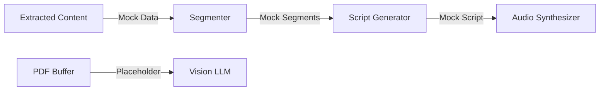
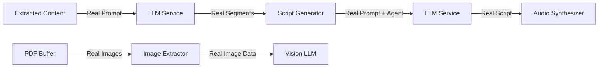

# Design Document: LLM Integration Completion

## Overview

**Parent Project**: PDF Lecture Service (`.kiro/specs/pdf-lecture-service/`)  
**Project Status**: 95% complete - all infrastructure functional  
**This Spec**: Addresses the remaining 5% - three specific LLM integrations

This design addresses three critical gaps in the PDF Lecture Service where placeholder implementations need to be replaced with real LLM API integrations:

1. **Content Segmentation** - Replace mock segmentation with real LLM-based topic analysis
2. **Script Generation** - Replace mock scripts with real LLM-based personality-driven content
3. **Image Extraction** - Replace placeholder images with actual PDF image extraction

All three components will leverage the existing, fully-functional LLM Service infrastructure.

## Architecture

### Current State



### Target State



## Components and Interfaces

### 1. Content Segmentation Integration

**File**: `src/services/segmenter.ts`  
**Function**: `callSegmentationLLM(prompt: string)`

#### Current Implementation (Placeholder)
```typescript
async function callSegmentationLLM(_prompt: string): Promise<LLMSegmentationResponse> {
  await new Promise(resolve => setTimeout(resolve, 200));
  return { segments: [/* mock data */] };
}
```

#### Target Implementation

```typescript
import { llmService, getRecommendedModel } from './llm';

async function callSegmentationLLM(prompt: string): Promise<LLMSegmentationResponse> {
  try {
    const model = getRecommendedModel('segmentation', llmService.getProvider());
    
    logger.info('Calling LLM for content segmentation', { model });
    
    const response = await llmService.chat({
      messages: [
        {
          role: 'system',
          content: `You are an expert at analyzing scientific documents and organizing content into logical segments.
          
Your task is to:
1. Identify distinct topics and concepts in the content
2. Group related concepts together
3. Determine prerequisite relationships between segments
4. Create a logical narrative flow

Return your response as JSON matching this structure:
{
  "segments": [
    {
      "title": "string",
      "contentIndices": {
        "pageRanges": [[startPage, endPage]],
        "figureIds": ["id1", "id2"],
        "tableIds": ["id1"],
        "formulaIds": ["id1"],
        "citationIds": ["id1"]
      },
      "prerequisites": [segmentIndex1, segmentIndex2]
    }
  ]
}`,
        },
        {
          role: 'user',
          content: prompt,
        },
      ],
      model,
      temperature: 0.7,
      maxTokens: 2000,
    });
    
    // Parse JSON response
    const segmentationData = JSON.parse(response.content);
    
    // Validate structure
    if (!segmentationData.segments || !Array.isArray(segmentationData.segments)) {
      throw new Error('Invalid segmentation response: missing segments array');
    }
    
    // Validate each segment
    for (const segment of segmentationData.segments) {
      if (!segment.title || !segment.contentIndices) {
        throw new Error('Invalid segment structure: missing required fields');
      }
    }
    
    logger.info('Segmentation completed successfully', {
      segmentCount: segmentationData.segments.length,
    });
    
    return segmentationData as LLMSegmentationResponse;
  } catch (error) {
    logger.error('Segmentation LLM call failed', { error });
    
    if (error instanceof SyntaxError) {
      throw new Error('Failed to parse LLM response as JSON');
    }
    
    throw new Error(`Failed to segment content: ${error instanceof Error ? error.message : 'Unknown error'}`);
  }
}
```

#### Prompt Construction Strategy

The prompt should include:
1. **Page summaries**: Brief summary of each page's content
2. **Element inventory**: List of figures, tables, formulas with page numbers
3. **Citation context**: Key citations and their locations
4. **Content length**: Total pages and estimated complexity

Example prompt structure:
```
Analyze this scientific document and segment it into logical topics:

DOCUMENT OVERVIEW:
- Total Pages: 12
- Figures: 5
- Tables: 3
- Formulas: 8
- Citations: 24

PAGE SUMMARIES:
Page 1-2: Introduction discussing [key concepts]
Page 3-5: Methodology describing [approach]
...

FIGURES:
- Figure 1 (Page 2): [caption or description]
- Figure 2 (Page 4): [caption or description]
...

TABLES:
- Table 1 (Page 3): [caption or description]
...

Please segment this content into logical topics with clear prerequisites.
```

### 2. Script Generation Integration

**File**: `src/services/script-generator.ts`  
**Function**: `callScriptGenerationLLM(prompt: string, agent: LectureAgent)`

#### Current Implementation (Placeholder)
```typescript
async function callScriptGenerationLLM(_prompt: string): Promise<string> {
  await new Promise(resolve => setTimeout(resolve, 200));
  return "Generic mock script text...";
}
```

#### Target Implementation

```typescript
import { llmService, getRecommendedModel } from './llm';
import { LectureAgent } from '../models/agent';

async function callScriptGenerationLLM(
  prompt: string,
  agent: LectureAgent
): Promise<string> {
  try {
    const model = getRecommendedModel('script', llmService.getProvider());
    
    logger.info('Calling LLM for script generation', { model, agentId: agent.id });
    
    // Build personality-specific system prompt
    const systemPrompt = buildScriptSystemPrompt(agent);
    
    const response = await llmService.chat({
      messages: [
        {
          role: 'system',
          content: systemPrompt,
        },
        {
          role: 'user',
          content: prompt,
        },
      ],
      model,
      temperature: 0.8, // Higher for more creative/personality-driven output
      maxTokens: 2000,
    });
    
    logger.info('Script generation completed successfully', {
      scriptLength: response.content.length,
    });
    
    return response.content;
  } catch (error) {
    logger.error('Script generation LLM call failed', { error, agentId: agent.id });
    throw new Error(`Failed to generate script: ${error instanceof Error ? error.message : 'Unknown error'}`);
  }
}

/**
 * Build system prompt incorporating agent personality
 */
function buildScriptSystemPrompt(agent: LectureAgent): string {
  const basePrompt = `You are a lecture script writer creating engaging educational content.

AGENT PERSONALITY:
${agent.personality.instructions}

TONE: ${agent.personality.tone}

GUIDELINES:
- Explain complex scientific concepts in accessible language
- Reference figures, tables, and formulas with clear verbal descriptions
- Maintain the specified tone throughout
- Create a natural, conversational flow
- Use analogies and examples to clarify difficult concepts`;

  // Add tone-specific guidance
  if (agent.personality.tone === 'humorous') {
    return basePrompt + `

HUMOR GUIDELINES:
- Include appropriate jokes or witty observations
- Use playful analogies
- Keep humor relevant to the content
- Don't force jokes - let them arise naturally`;
  } else if (agent.personality.tone === 'serious') {
    return basePrompt + `

FORMAL GUIDELINES:
- Maintain academic rigor
- Use precise scientific terminology
- Avoid colloquialisms
- Focus on clarity and accuracy`;
  }
  
  return basePrompt;
}
```

#### Prompt Construction Strategy

The prompt should include:
1. **Segment content**: The specific content for this segment
2. **Visual elements**: Descriptions of figures/tables/formulas to reference
3. **Context**: How this segment fits in the overall lecture
4. **Length guidance**: Target script length

Example prompt structure:
```
Create a lecture script for this segment:

SEGMENT: Introduction to Quantum Mechanics

CONTENT:
[Text content from pages 1-2]

VISUAL ELEMENTS TO REFERENCE:
- Figure 1: Wave-particle duality diagram
- Formula 1: Schrödinger equation (ℏ²/2m ∂²ψ/∂x² + V(x)ψ = Eψ)

CONTEXT:
This is the first segment. Assume no prior knowledge.

TARGET LENGTH: 2-3 minutes of speaking time

Create an engaging script that explains these concepts clearly.
```

### 3. Image Extraction Integration

**File**: `src/services/analyzer.ts`  
**Function**: `analyzeFigures(figurePositions, pdfBuffer)`

#### Current Implementation (Placeholder)
```typescript
const imageData = `data:image/png;base64,placeholder_${position.id}`;
```

#### Target Implementation - Option 1: Quick Win (pdf-img-convert)

```typescript
import { convert } from 'pdf-img-convert';

async function extractImageFromPDF(
  pdfBuffer: Buffer,
  pageNumber: number
): Promise<string> {
  try {
    logger.info('Extracting image from PDF', { pageNumber });
    
    // Convert specific page to image
    const images = await convert(pdfBuffer, {
      page_numbers: [pageNumber],
      base64: true,
      width: 2000, // High resolution for vision models
      height: 2000,
    });
    
    if (!images || images.length === 0) {
      throw new Error('No image extracted from PDF page');
    }
    
    // Optimize image size if needed
    const imageData = `data:image/png;base64,${images[0]}`;
    const optimizedImage = await optimizeImageForVisionAPI(imageData);
    
    logger.info('Image extracted successfully', {
      pageNumber,
      originalSize: imageData.length,
      optimizedSize: optimizedImage.length,
    });
    
    return optimizedImage;
  } catch (error) {
    logger.error('Image extraction failed', { pageNumber, error });
    throw new Error(`Failed to extract image from page ${pageNumber}: ${error instanceof Error ? error.message : 'Unknown error'}`);
  }
}

/**
 * Optimize image size for vision API
 * Reduces token usage and API costs
 */
async function optimizeImageForVisionAPI(base64Image: string): Promise<string> {
  // For quick win, return as-is
  // In production, use sharp or jimp to:
  // 1. Resize to max 2000x2000
  // 2. Compress to JPEG if PNG is too large
  // 3. Reduce quality to 85%
  
  return base64Image;
}
```

#### Target Implementation - Option 2: Production (pdf.js)

```typescript
import * as pdfjsLib from 'pdfjs-dist';

async function extractImagesFromPDF(
  pdfBuffer: Buffer,
  pageNumber: number
): Promise<string[]> {
  try {
    logger.info('Extracting images from PDF with pdf.js', { pageNumber });
    
    // Load the PDF document
    const loadingTask = pdfjsLib.getDocument({ data: pdfBuffer });
    const pdf = await loadingTask.promise;
    
    // Get the specific page
    const page = await pdf.getPage(pageNumber);
    
    // Get the page's operations
    const ops = await page.getOperatorList();
    
    const images: string[] = [];
    
    // Extract images from the operations
    for (let i = 0; i < ops.fnArray.length; i++) {
      if (ops.fnArray[i] === pdfjsLib.OPS.paintImageXObject) {
        const imageName = ops.argsArray[i][0];
        
        // Get the image object
        const image = await page.objs.get(imageName);
        
        // Convert to base64
        const base64 = await convertImageToBase64(image);
        images.push(base64);
      }
    }
    
    logger.info('Images extracted successfully', {
      pageNumber,
      imageCount: images.length,
    });
    
    return images;
  } catch (error) {
    logger.error('Image extraction with pdf.js failed', { pageNumber, error });
    throw new Error(`Failed to extract images: ${error instanceof Error ? error.message : 'Unknown error'}`);
  }
}
```

#### Updated analyzeFigures Function

```typescript
export async function analyzeFigures(
  figurePositions: Array<{ pageNumber: number; id: string }>,
  pdfBuffer: Buffer
): Promise<Figure[]> {
  logger.info('Starting figure analysis', { count: figurePositions.length });
  
  const figures: Figure[] = [];
  
  for (const position of figurePositions) {
    try {
      // STEP 1: Extract actual image from PDF
      const imageData = await extractImageFromPDF(pdfBuffer, position.pageNumber);
      
      // STEP 2: Generate description using vision LLM (already implemented!)
      const description = await generateFigureDescription(imageData, position.pageNumber);
      
      const figure: Figure = {
        id: position.id,
        pageNumber: position.pageNumber,
        imageData: imageData,
        description: description,
        caption: `Figure on page ${position.pageNumber}`,
      };
      
      figures.push(figure);
      logger.info('Figure analyzed', { figureId: position.id, pageNumber: position.pageNumber });
    } catch (error) {
      logger.error('Figure analysis failed', { figureId: position.id, error });
      // Continue with other figures even if one fails
    }
  }
  
  logger.info('Figure analysis completed', { totalFigures: figures.length });
  return figures;
}
```

## Error Handling Strategy

### Retry Logic

All LLM calls should use the existing retry mechanism:

```typescript
import { withRetry } from '../utils/retry';

const response = await withRetry(
  async () => llmService.chat(request),
  {
    maxAttempts: 3,
    initialDelayMs: 1000,
    maxDelayMs: 10000,
    backoffMultiplier: 2,
  }
);
```

### Error Categories

1. **Network Errors** - Retry with exponential backoff
2. **API Errors** (rate limit, auth) - Log and fail fast
3. **Parsing Errors** - Log response and fail with clear message
4. **Validation Errors** - Log invalid structure and fail

### Fallback Strategy

- **Segmentation**: If LLM fails, create single segment with all content
- **Script Generation**: If LLM fails, create basic descriptive script
- **Image Extraction**: If extraction fails, skip that figure and continue

## Testing Strategy

**Note**: The parent project already has comprehensive test infrastructure with Jest and fast-check. This spec adds tests for the three new integrations only.

**Existing Test Suite**: 17 unit tests + property-based tests (all passing)  
**This Spec Adds**: ~15 new tests for LLM integrations

### Unit Tests

1. **Segmentation**:
   - Test prompt construction with various content types
   - Test JSON parsing with valid/invalid responses
   - Test validation logic for segment structure
   - Mock LLM service to test error handling

2. **Script Generation**:
   - Test system prompt construction for different agent personalities
   - Test prompt construction with various segment types
   - Mock LLM service to test error handling
   - Verify agent personality is included in prompts

3. **Image Extraction**:
   - Test with PDFs containing images
   - Test with PDFs without images
   - Test error handling for corrupt images
   - Test image optimization logic

### Integration Tests

1. **End-to-End Segmentation**:
   - Process real PDF with real LLM API
   - Verify different PDFs produce different segments
   - Verify segment structure is valid

2. **End-to-End Script Generation**:
   - Generate scripts with different agents
   - Verify personality differences in output
   - Verify content-specific references

3. **End-to-End Image Extraction**:
   - Extract images from real scientific PDFs
   - Verify vision LLM can analyze extracted images
   - Verify descriptions are meaningful

### Property-Based Tests

**Property 1: Segmentation Determinism**
*For any* extracted content, calling segmentation twice with the same content should produce similar segment structures (allowing for LLM variability).

**Property 2: Script Personality Influence**
*For any* segment content, generating scripts with humorous vs. serious agents should produce measurably different outputs (e.g., different word choices, sentence structures).

**Property 3: Image Extraction Completeness**
*For any* PDF with N figures detected, image extraction should attempt to extract N images (may fail for some, but should try all).

## Performance Considerations

### API Costs

- **Segmentation**: ~$0.01-0.05 per PDF (one call per PDF)
- **Script Generation**: ~$0.05-0.15 per PDF (one call per segment, typically 3-5 segments)
- **Vision Analysis**: ~$0.01-0.03 per figure (already implemented)

**Total per PDF**: ~$0.10-0.30

### Processing Time

- **Segmentation**: +5-10 seconds (LLM call)
- **Script Generation**: +10-20 seconds (multiple LLM calls)
- **Image Extraction**: +2-5 seconds per figure

**Total additional time**: +20-40 seconds per PDF

### Optimization Strategies

1. **Caching**: Cache LLM responses for identical inputs
2. **Parallel Processing**: Process segments in parallel for script generation
3. **Image Optimization**: Resize images before sending to vision API
4. **Prompt Optimization**: Keep prompts concise to reduce token usage

## Deployment Considerations

**Note**: The parent project already has full deployment infrastructure (AWS SAM, LocalStack, etc.). This spec only adds feature flags and monitoring for the new integrations.

**Existing Infrastructure**: ✅ Lambda, API Gateway, DynamoDB, S3, CloudWatch  
**This Spec Adds**: Feature flags and LLM-specific monitoring

### Environment Variables

Add to existing `.env`:
```bash
# LLM Configuration (already exists)
OPENROUTER_API_KEY=your_key_here
OPENAI_API_KEY=your_key_here
ANTHROPIC_API_KEY=your_key_here

# Feature Flags (new)
ENABLE_REAL_SEGMENTATION=true
ENABLE_REAL_SCRIPT_GENERATION=true
ENABLE_IMAGE_EXTRACTION=true
```

### Gradual Rollout

1. **Phase 1**: Deploy segmentation integration, monitor quality
2. **Phase 2**: Deploy script generation integration, monitor quality
3. **Phase 3**: Deploy image extraction, monitor costs

### Monitoring

Track these metrics:
- LLM API success rate
- Average response time
- Token usage per PDF
- Cost per PDF
- Segmentation quality (manual review)
- Script quality (manual review)

## Dependencies

### New Dependencies Required

For image extraction (Option 1 - Quick Win):
```json
{
  "pdf-img-convert": "^1.0.0"
}
```

For image extraction (Option 2 - Production):
```json
{
  "pdfjs-dist": "^3.11.174",
  "canvas": "^2.11.2"
}
```

For image optimization (Optional):
```json
{
  "sharp": "^0.32.0"
}
```

### Existing Dependencies (Already Available)

- ✅ `llmService` - Fully functional
- ✅ `withRetry` - Retry logic
- ✅ `logger` - Structured logging
- ✅ All database and storage utilities

## Migration Strategy

### Backward Compatibility

- Keep placeholder implementations as fallback (controlled by feature flags)
- Allow gradual migration of existing jobs
- Provide clear logging when using placeholder vs. real implementation

### Testing in Production

1. Enable for 10% of jobs initially
2. Monitor quality and costs
3. Gradually increase to 100%
4. Remove placeholder code after 2 weeks of stable operation

## Success Criteria

1. ✅ Different PDFs produce different segmentation structures
2. ✅ Different agents produce different script styles
3. ✅ Vision LLM receives real images and produces meaningful descriptions
4. ✅ All integration tests pass with real LLM APIs
5. ✅ API costs remain under $0.50 per PDF
6. ✅ Processing time increases by less than 60 seconds per PDF
