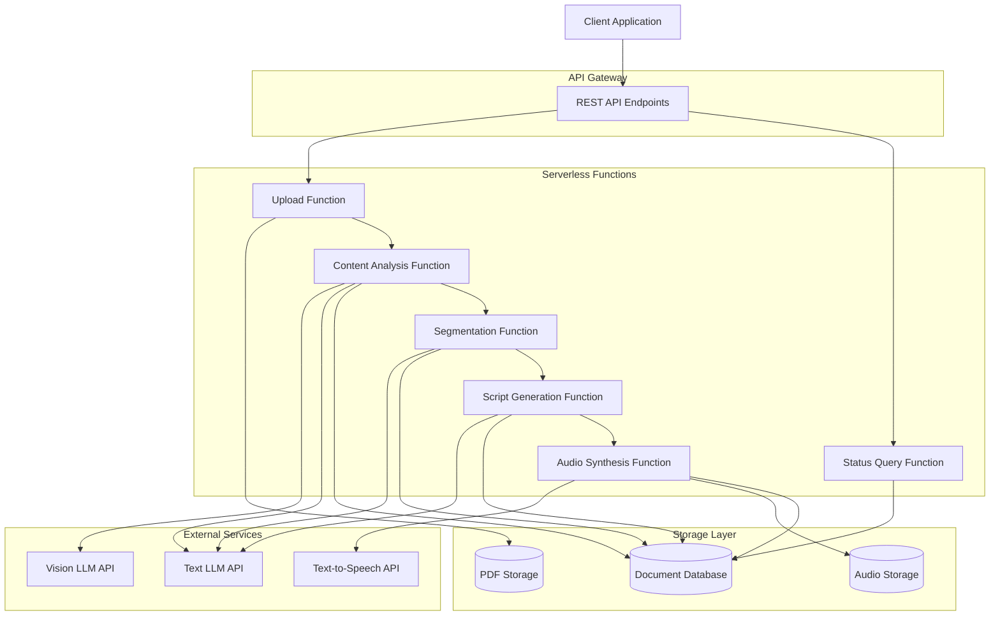

# Design Document: PDF Lecture Service

## Overview

The PDF Lecture Service is a serverless application that transforms dense scientific PDFs into engaging audio lectures with synchronized visual playback. The system employs a multi-stage pipeline architecture where each stage is implemented as an independent serverless function, enabling scalability and maintainability.

The pipeline consists of five main stages:
1. **PDF Upload & Storage** - Accepts and validates PDF files
2. **Content Analysis** - Extracts and interprets all PDF elements using computer vision and LLM
3. **Content Segmentation** - Organizes content into logical topic flows
4. **Script Generation** - Creates personality-driven lecture scripts
5. **Audio Synthesis & Playback** - Generates audio and provides synchronized viewing experience

The system supports multiple configurable lecture agents, each with distinct personalities and voice characteristics, allowing users to customize their learning experience.

## Architecture

### High-Level Architecture



### Processing Pipeline

The system uses an event-driven architecture where each function triggers the next upon successful completion:

1. **Upload** → Stores PDF, creates job record → Triggers **Analyze**
2. **Analyze** → Extracts all content → Triggers **Segment**
3. **Segment** → Creates logical flow → Triggers **Script**
4. **Script** → Generates lecture text → Triggers **Audio**
5. **Audio** → Produces MP3 with timing data → Marks job complete

### Local Development Architecture

For local testing, each serverless function is wrapped in an HTTP server endpoint:

```
POST /api/upload          → Upload Function
POST /api/analyze/:jobId  → Analysis Function
POST /api/segment/:jobId  → Segmentation Function
POST /api/script/:jobId   → Script Generation Function
POST /api/audio/:jobId    → Audio Synthesis Function
GET  /api/status/:jobId   → Status Query Function
GET  /api/player/:jobId   → Playback Interface
```

## Components and Interfaces

### 1. Upload Service

**Responsibility:** Accept PDF uploads, validate files, store in object storage, initialize job tracking.

**Interface:**
```typescript
interface UploadRequest {
  file: Buffer;
  filename: string;
  agentId?: string; // Optional: pre-select agent
}

interface UploadResponse {
  jobId: string;
  status: 'queued';
  message: string;
}

interface UploadError {
  error: string;
  code: 'FILE_TOO_LARGE' | 'INVALID_PDF' | 'UPLOAD_FAILED';
}
```

**Validation Rules:**
- Maximum file size: 100MB
- File type: PDF (validated by magic bytes, not just extension)
- File must be readable by PDF parser

### 2. Content Analyzer

**Responsibility:** Extract and interpret all PDF elements including text, figures, tables, formulas, and citations.

**Interface:**
```typescript
interface AnalysisInput {
  jobId: string;
  pdfUrl: string;
}

interface ExtractedContent {
  pages: PageContent[];
  figures: Figure[];
  tables: Table[];
  formulas: Formula[];
  citations: Citation[];
}

interface PageContent {
  pageNumber: number;
  text: string;
  elements: ElementReference[]; // References to figures, tables, formulas on this page
}

interface Figure {
  id: string;
  pageNumber: number;
  imageData: string; // Base64 or URL
  description: string; // Generated by vision model
  caption?: string;
}

interface Table {
  id: string;
  pageNumber: number;
  headers: string[];
  rows: string[][];
  interpretation: string; // Generated explanation
}

interface Formula {
  id: string;
  pageNumber: number;
  latex: string;
  explanation: string; // Generated explanation
}

interface Citation {
  id: string;
  text: string;
  authors?: string[];
  year?: number;
  title?: string;
}
```

**Processing Strategy:**
1. Use PDF parsing library to extract text and identify element positions
2. For each figure: Extract image → Send to vision LLM → Generate description
3. For each table: Extract structure → Send to LLM → Generate interpretation
4. For each formula: Extract LaTeX → Send to LLM → Generate explanation
5. For citations: Use regex patterns and LLM to identify and parse

### 3. Content Segmenter

**Responsibility:** Organize extracted content into logical topic segments with natural flow.

**Interface:**
```typescript
interface SegmentationInput {
  jobId: string;
  extractedContent: ExtractedContent;
}

interface SegmentedContent {
  segments: ContentSegment[];
}

interface ContentSegment {
  id: string;
  title: string;
  order: number;
  contentBlocks: ContentBlock[];
  prerequisites: string[]; // IDs of segments that should come before this one
}

interface ContentBlock {
  type: 'text' | 'figure' | 'table' | 'formula' | 'citation';
  content: string | Figure | Table | Formula | Citation;
  pageReference: number;
}
```

**Segmentation Strategy:**
1. Send extracted content to LLM with prompt: "Identify distinct topics and organize into logical segments"
2. LLM returns segment boundaries and titles
3. Analyze dependencies between segments (e.g., concepts that build on each other)
4. Topologically sort segments to ensure prerequisites come first
5. Assign content blocks to appropriate segments

### 4. Lecture Agent Manager

**Responsibility:** Store and retrieve lecture agent configurations.

**Interface:**
```typescript
interface LectureAgent {
  id: string;
  name: string;
  description: string;
  personality: PersonalityConfig;
  voice: VoiceConfig;
  createdAt: Date;
}

interface PersonalityConfig {
  instructions: string; // Free-form instructions for script generation
  tone: 'humorous' | 'serious' | 'casual' | 'formal' | 'enthusiastic';
  examples?: string[]; // Example phrases or styles
}

interface VoiceConfig {
  voiceId: string; // TTS provider voice identifier
  speed: number; // 0.5 to 2.0
  pitch: number; // -20 to 20
}

interface AgentOperations {
  createAgent(agent: Omit<LectureAgent, 'id' | 'createdAt'>): Promise<LectureAgent>;
  getAgent(id: string): Promise<LectureAgent | null>;
  listAgents(): Promise<LectureAgent[]>;
  updateAgent(id: string, updates: Partial<LectureAgent>): Promise<LectureAgent>;
  deleteAgent(id: string): Promise<void>;
}
```

### 5. Script Generator

**Responsibility:** Create lecture scripts that explain content in the agent's personality style.

**Interface:**
```typescript
interface ScriptGenerationInput {
  jobId: string;
  segmentedContent: SegmentedContent;
  agent: LectureAgent;
}

interface LectureScript {
  segments: ScriptSegment[];
  totalEstimatedDuration: number; // seconds
}

interface ScriptSegment {
  segmentId: string;
  title: string;
  scriptBlocks: ScriptBlock[];
}

interface ScriptBlock {
  id: string;
  text: string; // The actual lecture text to be spoken
  contentReference: {
    type: 'text' | 'figure' | 'table' | 'formula' | 'citation';
    id: string;
    pageNumber: number;
  };
  estimatedDuration: number; // seconds
}
```

**Script Generation Strategy:**
1. For each segment, construct LLM prompt with:
   - Content blocks in the segment
   - Agent personality instructions
   - Examples of the agent's style
   - Instructions to explain complex concepts simply
2. LLM generates lecture text for the segment
3. Post-process to add timing estimates (words per minute calculation)
4. Ensure references to figures/tables/formulas include clear verbal descriptions

### 6. Audio Synthesizer

**Responsibility:** Convert lecture script to MP3 audio with word-level timing data.

**Interface:**
```typescript
interface AudioSynthesisInput {
  jobId: string;
  script: LectureScript;
  agent: LectureAgent;
}

interface AudioOutput {
  audioUrl: string; // URL to MP3 file
  duration: number; // seconds
  wordTimings: WordTiming[];
}

interface WordTiming {
  word: string;
  startTime: number; // seconds
  endTime: number; // seconds
  scriptBlockId: string;
}
```

**Synthesis Strategy:**
1. Concatenate all script blocks into full text
2. Send to TTS API with agent's voice configuration
3. Receive audio file and word-level timing data
4. Store MP3 in object storage
5. Store timing data in database for synchronization

### 7. Immersive Reader / Playback Interface

**Responsibility:** Display PDF, script, and synchronized highlighting during audio playback.

**Interface:**
```typescript
interface PlaybackState {
  jobId: string;
  pdfUrl: string;
  script: LectureScript;
  audioUrl: string;
  wordTimings: WordTiming[];
  currentTime: number;
  isPlaying: boolean;
}

interface HighlightState {
  currentWord: string;
  currentScriptBlockId: string;
  currentPageNumber: number;
  highlightPosition: {
    scriptOffset: number; // Character offset in script
    pdfRegion?: BoundingBox; // Optional PDF highlight region
  };
}

interface BoundingBox {
  page: number;
  x: number;
  y: number;
  width: number;
  height: number;
}
```

**Synchronization Strategy:**
1. Load audio element and attach timeupdate event listener
2. On each time update (typically 250ms intervals):
   - Binary search wordTimings array to find current word
   - Update script highlighting to current word
   - Scroll script view if needed to keep highlighted word visible
   - Update PDF view to show corresponding page
   - Optionally highlight PDF region if bounding box available
3. Handle user interactions (pause, seek, play) by updating currentTime

### 8. Job Status Tracker

**Responsibility:** Track processing status and enable status queries.

**Interface:**
```typescript
interface Job {
  jobId: string;
  status: JobStatus;
  createdAt: Date;
  updatedAt: Date;
  pdfFilename: string;
  agentId?: string;
  stages: StageStatus[];
  error?: string;
}

type JobStatus = 
  | 'queued'
  | 'analyzing'
  | 'segmenting'
  | 'generating_script'
  | 'synthesizing_audio'
  | 'completed'
  | 'failed';

interface StageStatus {
  stage: string;
  status: 'pending' | 'in_progress' | 'completed' | 'failed';
  startedAt?: Date;
  completedAt?: Date;
  error?: string;
}
```

## Data Models

### Database Schema

**Jobs Collection/Table:**
```typescript
{
  jobId: string (PK);
  status: JobStatus;
  createdAt: timestamp;
  updatedAt: timestamp;
  pdfFilename: string;
  pdfUrl: string;
  agentId: string (FK);
  stages: StageStatus[];
  error?: string;
}
```

**Agents Collection/Table:**
```typescript
{
  id: string (PK);
  name: string;
  description: string;
  personality: {
    instructions: string;
    tone: string;
    examples: string[];
  };
  voice: {
    voiceId: string;
    speed: number;
    pitch: number;
  };
  createdAt: timestamp;
}
```

**Content Collection/Table:**
```typescript
{
  jobId: string (PK);
  extractedContent: ExtractedContent;
  segmentedContent: SegmentedContent;
  script: LectureScript;
  audioUrl: string;
  wordTimings: WordTiming[];
  createdAt: timestamp;
}
```

### Storage Structure

**Object Storage (S3/Cloud Storage):**
```
/pdfs/{jobId}/original.pdf
/audio/{jobId}/lecture.mp3
/cache/{jobId}/figures/{figureId}.png
```

## C
orrectness Properties

*A property is a characteristic or behavior that should hold true across all valid executions of a system—essentially, a formal statement about what the system should do. Properties serve as the bridge between human-readable specifications and machine-verifiable correctness guarantees.*

### Upload and Validation Properties

**Property 1: Valid PDF acceptance**
*For any* valid PDF file under 100MB, uploading it should result in a successful response with a unique job ID and initiate the processing pipeline.
**Validates: Requirements 1.1, 1.5**

**Property 2: Unique job ID generation**
*For any* two successful PDF uploads, the returned job IDs should be distinct.
**Validates: Requirements 1.5**

**Property 3: Invalid input rejection**
*For any* corrupted or unreadable PDF file, the upload should be rejected with an appropriate error message.
**Validates: Requirements 1.3**

### Content Analysis Properties

**Property 4: Complete text extraction**
*For any* PDF with text content, the Content Analyzer should extract text from all pages, and the total extracted text length should be greater than zero.
**Validates: Requirements 2.1**

**Property 5: Multi-modal content detection**
*For any* PDF containing figures, tables, formulas, or citations, the Content Analyzer should detect and extract each type of element present.
**Validates: Requirements 1.4, 2.2, 2.3, 2.4, 2.5**

**Property 6: Figure description generation**
*For any* PDF with figures, each detected figure should have a non-empty description generated by the vision model.
**Validates: Requirements 2.2**

**Property 7: Table interpretation**
*For any* PDF with tables, each detected table should have extracted structure (headers and rows) and a non-empty interpretation.
**Validates: Requirements 2.3**

**Property 8: Formula explanation**
*For any* PDF with mathematical formulas, each detected formula should have a LaTeX representation and a non-empty explanation.
**Validates: Requirements 2.4**

### Content Segmentation Properties

**Property 9: Segmentation completeness**
*For any* extracted content, the Content Segmenter should produce at least one segment, and all content blocks should be assigned to exactly one segment.
**Validates: Requirements 3.1, 3.5**

**Property 10: Segment structure validity**
*For any* segmented content, each segment should have a non-empty title, a valid order number, and at least one content block.
**Validates: Requirements 3.5**

**Property 11: Prerequisite ordering**
*For any* segment with prerequisites, all prerequisite segments should have lower order numbers than the dependent segment.
**Validates: Requirements 3.4**

**Property 12: Coherent grouping**
*For any* segment, all content blocks within that segment should reference pages within a reasonable range (e.g., within 5 pages of each other), indicating topical coherence.
**Validates: Requirements 3.2**

### Agent Management Properties

**Property 13: Agent creation round-trip**
*For any* valid agent configuration, creating the agent and then retrieving it should return an equivalent agent with all fields preserved.
**Validates: Requirements 4.1**

**Property 14: Agent listing completeness**
*For any* set of created agents, listing all agents should return all created agents with their names and descriptions.
**Validates: Requirements 4.2**

**Property 15: Multiple agent support**
*For any* two distinct agent configurations, both should be stored independently and retrievable by their unique IDs.
**Validates: Requirements 4.4**

### Script Generation Properties

**Property 16: Script generation completeness**
*For any* segmented content and agent configuration, the Script Generator should produce a non-empty script with at least one script block per content segment.
**Validates: Requirements 5.1**

**Property 17: Agent personality influence**
*For any* segmented content, generating scripts with a humorous agent and a serious agent should produce different scripts, where the humorous script contains informal language or humor markers and the serious script maintains formal language.
**Validates: Requirements 4.5, 4.6, 5.3, 5.4**

**Property 18: Visual element descriptions**
*For any* script that references figures, tables, or formulas, each reference should include a verbal description in the script text.
**Validates: Requirements 5.5**

**Property 19: Script timing data**
*For any* generated script, each script block should have a positive estimated duration, and the total duration should equal the sum of block durations.
**Validates: Requirements 5.6**

**Property 20: Accessibility improvement**
*For any* source content and generated script, the script should have a lower complexity score (measured by average sentence length or readability index) than the source material.
**Validates: Requirements 5.2**

### Audio Synthesis Properties

**Property 21: Audio generation success**
*For any* valid lecture script and agent configuration, the Audio Synthesizer should generate a valid MP3 file with a duration greater than zero.
**Validates: Requirements 6.1**

**Property 22: Voice configuration application**
*For any* agent with specific voice settings (voice ID, speed, pitch), the Audio Synthesizer should use those exact settings when calling the TTS API.
**Validates: Requirements 6.2, 6.3, 6.4**

**Property 23: Audio metadata completeness**
*For any* generated audio, the output should include a valid audio URL, a positive duration value, and word-level timing data for all words in the script.
**Validates: Requirements 6.6**

**Property 24: Timing data consistency**
*For any* generated audio with word timings, the timings should be monotonically increasing (each word's start time ≥ previous word's end time), and the last word's end time should approximately equal the total audio duration.
**Validates: Requirements 6.6**

### Playback Synchronization Properties

**Property 25: Highlight synchronization**
*For any* playback time during audio playback, the highlighted word in the script should be the word whose timing interval contains the current playback time, and the highlight should update within 100 milliseconds of the time change.
**Validates: Requirements 7.3, 8.1**

**Property 26: Single highlight invariant**
*For any* moment during playback, at most one word should be highlighted in the script.
**Validates: Requirements 8.2**

**Property 27: PDF page synchronization**
*For any* playback time, the displayed PDF page should match the page number referenced by the current script block.
**Validates: Requirements 7.4**

**Property 28: Seek consistency**
*For any* seek operation to a new playback time, the highlighting and PDF page should update to match the new time within 100 milliseconds.
**Validates: Requirements 7.5**

**Property 29: Auto-scroll behavior**
*For any* segment transition during playback, if the highlighted text is outside the visible script area, the script view should scroll to make the highlighted text visible.
**Validates: Requirements 8.3**

**Property 30: PDF element highlighting**
*For any* script block that references a specific PDF element (figure, table, formula) with bounding box coordinates, the PDF view should highlight or indicate that region when the block is being spoken.
**Validates: Requirements 8.4**

**Property 31: Long-duration synchronization accuracy**
*For any* complete lecture playback, the maximum synchronization drift between audio time and highlight time should remain below 200 milliseconds throughout the entire duration.
**Validates: Requirements 8.5**

### Serverless Architecture Properties

**Property 32: Function execution and persistence**
*For any* serverless function invocation with valid input, the function should complete successfully, return results, and store those results in the database for retrieval by subsequent functions.
**Validates: Requirements 9.2, 9.5**

**Property 33: Asynchronous processing support**
*For any* long-running operation (analysis, segmentation, script generation, audio synthesis), the function should return a job ID immediately without blocking, and the operation should continue asynchronously.
**Validates: Requirements 9.4**

**Property 34: Agent selection persistence**
*For any* job created with a selected agent, the agent's configuration should be used throughout all processing stages (segmentation, script generation, audio synthesis).
**Validates: Requirements 4.3**

### Local Development Properties

**Property 35: Local-serverless interface compatibility**
*For any* serverless function, the local HTTP endpoint should accept the same input parameters and return the same output structure as the deployed serverless function.
**Validates: Requirements 10.2, 10.3**

## Error Handling

### Error Categories

1. **Validation Errors** - Invalid input data (file too large, corrupted PDF, invalid agent config)
2. **Processing Errors** - Failures during content analysis, segmentation, or script generation
3. **External Service Errors** - LLM API failures, TTS API failures, storage failures
4. **Resource Errors** - Out of memory, timeout, quota exceeded

### Error Handling Strategy

**Validation Errors:**
- Fail fast at the earliest possible point
- Return clear, actionable error messages to the user
- HTTP 400 Bad Request for client errors

**Processing Errors:**
- Retry transient failures up to 3 times with exponential backoff
- Log detailed error information for debugging
- Update job status to 'failed' with error message
- HTTP 500 Internal Server Error for server errors

**External Service Errors:**
- Implement circuit breaker pattern for external APIs
- Fall back to alternative services if available
- Store partial results to enable manual recovery
- Retry with exponential backoff (max 3 attempts)

**Resource Errors:**
- Implement timeouts for all operations (5 minutes for analysis, 10 minutes for audio synthesis)
- Stream large files instead of loading into memory
- Clean up temporary resources in finally blocks
- Return HTTP 503 Service Unavailable for resource exhaustion

### Error Response Format

```typescript
interface ErrorResponse {
  error: string; // Human-readable error message
  code: string; // Machine-readable error code
  jobId?: string; // If applicable
  details?: Record<string, any>; // Additional context
  retryable: boolean; // Whether the client should retry
}
```

### Job Failure Recovery

When a job fails:
1. Update job status to 'failed'
2. Store error details in job record
3. Preserve all successfully completed stages
4. Allow manual retry from the failed stage
5. Send notification if user provided contact info

## Testing Strategy

The PDF Lecture Service will employ a comprehensive testing approach combining unit tests and property-based tests to ensure correctness across all components.

### Property-Based Testing

Property-based testing will be the primary method for verifying the correctness properties defined in this document. We will use **fast-check** (for TypeScript/JavaScript) as our property-based testing library.

**Configuration:**
- Each property-based test will run a minimum of 100 iterations
- Tests will use custom generators for domain-specific types (PDFs, agents, scripts)
- Each test will be tagged with a comment referencing the specific correctness property from this design document

**Tagging Format:**
```typescript
// Feature: pdf-lecture-service, Property 1: Valid PDF acceptance
```

**Property Test Coverage:**
- All 35 correctness properties defined above will be implemented as property-based tests
- Each property will have exactly one corresponding property-based test
- Tests will be placed as close to the implementation as possible to catch errors early

**Custom Generators:**
We will implement generators for:
- Valid and invalid PDF files (with varying content types)
- Agent configurations (with different personalities and voice settings)
- Extracted content structures (with figures, tables, formulas, citations)
- Segmented content (with various dependency graphs)
- Lecture scripts (with timing data)
- Word timing arrays (with realistic timing intervals)

### Unit Testing

Unit tests will complement property-based tests by verifying specific examples, edge cases, and integration points.

**Unit Test Coverage:**
- Specific examples demonstrating correct behavior for each component
- Edge cases identified during development (empty PDFs, single-page documents, etc.)
- Integration between components (e.g., pipeline stage transitions)
- Error handling paths (validation failures, API errors, timeouts)
- Mock external services (LLM APIs, TTS APIs) for isolated testing

**Key Unit Test Areas:**
1. **Upload validation** - Test file size limits, PDF format validation, error messages
2. **Content extraction** - Test specific PDF structures, element detection accuracy
3. **Segmentation logic** - Test dependency resolution, topological sorting
4. **Agent management** - Test CRUD operations, validation rules
5. **Script generation** - Test personality application, timing calculations
6. **Audio synthesis** - Test TTS API integration, timing data processing
7. **Synchronization** - Test highlight updates, seek operations, scroll behavior
8. **Local endpoints** - Test HTTP interface, request/response handling

### Testing Tools

- **Property-based testing**: fast-check
- **Unit testing**: Jest
- **API testing**: Supertest
- **PDF generation**: pdf-lib (for test fixtures)
- **Mocking**: Jest mocks for external services

### Test Execution

- All tests run on every commit (CI/CD pipeline)
- Property-based tests run with 100 iterations in CI, 1000 iterations nightly
- Unit tests must maintain >80% code coverage
- Integration tests run against local endpoints before deployment
- End-to-end tests run against deployed serverless functions in staging environment

## Deployment Architecture

### Serverless Platform

The system will be deployed on **AWS Lambda** with the following services:

- **API Gateway** - REST API endpoints
- **Lambda Functions** - Serverless compute for each processing stage
- **S3** - Object storage for PDFs and audio files
- **DynamoDB** - NoSQL database for jobs, agents, and content
- **EventBridge** - Event-driven function triggering
- **CloudWatch** - Logging and monitoring

### Function Configuration

Each Lambda function will have:
- Memory: 1024MB (adjustable based on profiling)
- Timeout: 5 minutes (analysis/segmentation), 10 minutes (audio synthesis)
- Runtime: Node.js 20.x
- Environment variables for API keys and configuration

### Local Development Setup

For local testing, the system will use:
- **Express.js** - HTTP server wrapping Lambda functions
- **LocalStack** - Local AWS service emulation (S3, DynamoDB)
- **Docker Compose** - Orchestrate local services
- **dotenv** - Environment configuration

### CI/CD Pipeline

1. **Build** - Compile TypeScript, bundle dependencies
2. **Test** - Run unit tests and property-based tests
3. **Package** - Create Lambda deployment packages
4. **Deploy to Staging** - Deploy to staging environment
5. **Integration Tests** - Run end-to-end tests against staging
6. **Deploy to Production** - Deploy to production with blue-green deployment

## Performance Considerations

### Expected Processing Times

- **Upload**: < 1 second
- **Content Analysis**: 30-120 seconds (depending on PDF complexity)
- **Segmentation**: 10-30 seconds
- **Script Generation**: 20-60 seconds
- **Audio Synthesis**: 30-180 seconds (depending on script length)
- **Total Pipeline**: 2-6 minutes for typical scientific paper

### Optimization Strategies

1. **Parallel Processing** - Process figures, tables, and formulas in parallel during analysis
2. **Caching** - Cache LLM responses for identical inputs
3. **Streaming** - Stream large PDFs and audio files to avoid memory limits
4. **Batch Processing** - Batch multiple TTS requests when possible
5. **CDN** - Serve static assets (PDFs, audio) through CloudFront CDN

### Scalability

- Lambda auto-scales to handle concurrent requests
- DynamoDB provisioned with auto-scaling
- S3 handles unlimited storage
- Rate limiting on API Gateway to prevent abuse
- Queue system (SQS) for handling burst traffic

## Security Considerations

### Authentication and Authorization

- API key authentication for all endpoints
- JWT tokens for user sessions in playback interface
- Role-based access control for agent management
- Rate limiting per API key

### Data Protection

- PDFs and audio files encrypted at rest (S3 server-side encryption)
- Database encrypted at rest (DynamoDB encryption)
- TLS 1.3 for all data in transit
- Signed URLs for temporary access to S3 objects (expire after 1 hour)

### Input Validation

- File type validation using magic bytes
- File size limits enforced
- Input sanitization for all text fields
- SQL injection prevention (using parameterized queries)
- XSS prevention in playback interface

### Privacy

- No permanent storage of PDF content after processing (optional)
- User data anonymization in logs
- GDPR compliance for EU users
- Data retention policy (delete jobs after 30 days)

## Monitoring and Observability

### Metrics

- Request count and error rate per endpoint
- Processing time per pipeline stage
- External API latency and error rates
- Storage usage (S3, DynamoDB)
- Cost per job

### Logging

- Structured JSON logs with correlation IDs
- Log levels: ERROR, WARN, INFO, DEBUG
- Sensitive data redaction in logs
- Centralized log aggregation (CloudWatch Logs)

### Alerting

- Alert on error rate > 5%
- Alert on processing time > 10 minutes
- Alert on external API failures
- Alert on storage quota approaching limit

### Tracing

- Distributed tracing with AWS X-Ray
- Trace entire pipeline from upload to completion
- Identify bottlenecks and optimization opportunities
